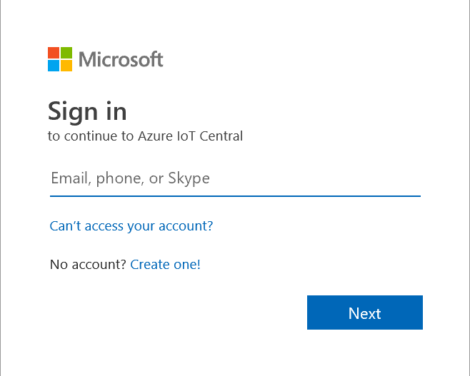
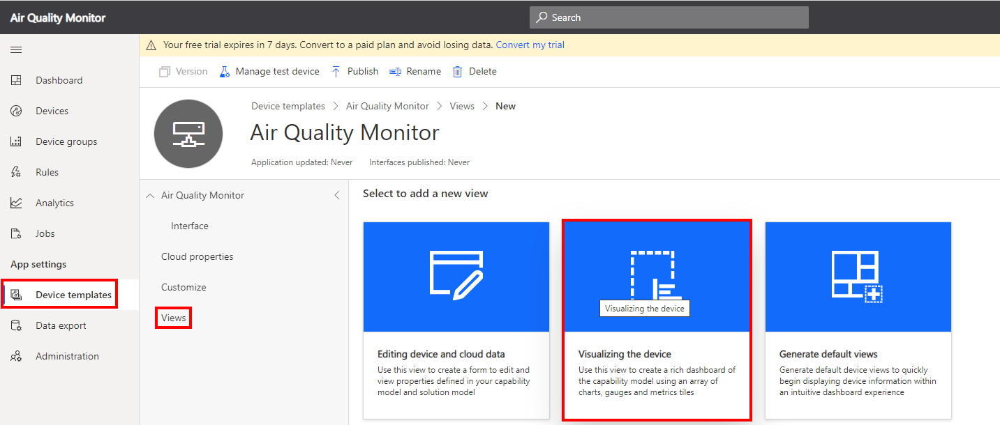

# Module 1: Create an Azure IoT Hub

---

## Index

* Module 1: [Create an Azure IoT Central application](../module_1_create_iot_hub/README.md)
* Module 2: [Set up your Raspberry Pi](../module_2_set_up_raspberry_pi/README.md)
* Module 3: [Set up your development environment](../module_3_set_up_computer/README.md)
* Module 4: [Run the solution](../module_4_building_the_solution/README.md)

* [Home](../../README.md)

---

## Introduction to Azure IoT Central

[Azure IoT Central](https://azure.microsoft.com/en-in/services/iot-central/?WT.mc_id=julyot-azd-dglover) provides an easy way to connect, monitor, and manage your Internet of Things (IoT) assets at scale.

This lab will be using Azure IoT Central to graph air quality levels and set alerts. We are going to create an Azure IoT Central application and then one device.

---

## Create a New IoT Central Application

1. So the lab instructions are still visible, right mouse click, and open this link "[Azure IoT Central](https://azure.microsoft.com/en-au/services/iot-central/?WT.mc_id=pycon-blog-dglover)" in a new window.

2. Click **Build a solution**.

3. Next, you will need to sign with your Microsoft Personal, or Work, or School account. If you do not have a Microsoft account, then you can create one for free using the **Create one!** link.

    

4. Expand the sidebar menu by clicking on the **Burger menu** icon.

    

5. Click **+ New application** to create a new Azure IoT Central application. 

6. Select **Custom app**

    

### Create a new application

1. Specify the **Application name**, the **URL**, select the **Free** pricing plan, and complete the registration form. 

    

2. Then click **Create**.

### Create a new device template

A device template is a blueprint that defines the characteristics and behaviors of a type of device that connects to an Azure IoT Central application.

For more information on device templates, review the [Define a new IoT device type in your Azure IoT Central application](https://docs.microsoft.com/en-us/azure/iot-central/core/howto-set-up-template?WT.mc_id=github-blog-dglover) article. 

1. Click **Device templates**, then **+ New**.
    

2. Click the **IoT device** template type.

    

3. Create an **IoT Device** Template.

    1. Select **IoT device**,
    2. Click **Next:Customise**,
    3. Name your template **Air Quality Monitor**,
    4. Click **Next: Review**,
    5. Click **Create**.

#### Import a Capability Model

1. Add an Interface

    1. Click **Import capability model**
    2. Navigate to the folder you cloned the solution into.
    3. Select **Air Quality Monitor.json** and open

### Import a Capability Model

1. Click **Import capability model**
2. Navigate to the folder you cloned this solution into.
3. Navigate to the **iot_central** folder.
4. Select **Air Quality Monitor.json** and open

### Create a device visualization view

2. Create a view
    1. Click **Views**
        
    2. Select **Visualizing the device**
    3. Select the Particular Matter telemetry
        
    4. Click **Add Tile**
    5. Select Humidity, Pressure, and Temperature telemetry.
        
    6. Click **Add Tile**
    7. Drag the Humidity, Pressure, Temperature tile so that it lines up with the Particular Matter tile.
        
    8. **Save** the view
        
         

3. Click **Publish** to publish the template
     
    

---

## Create a device

---

**[NEXT](../module_2_install_azure_iot_edge/README.md)**

---
