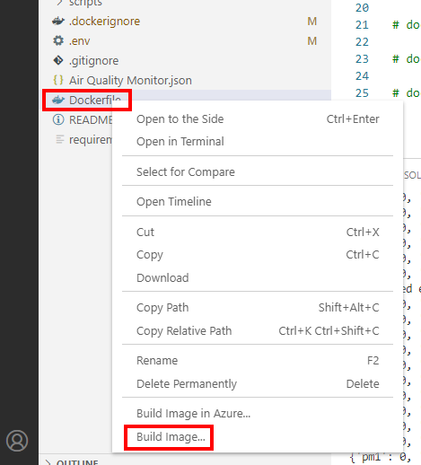
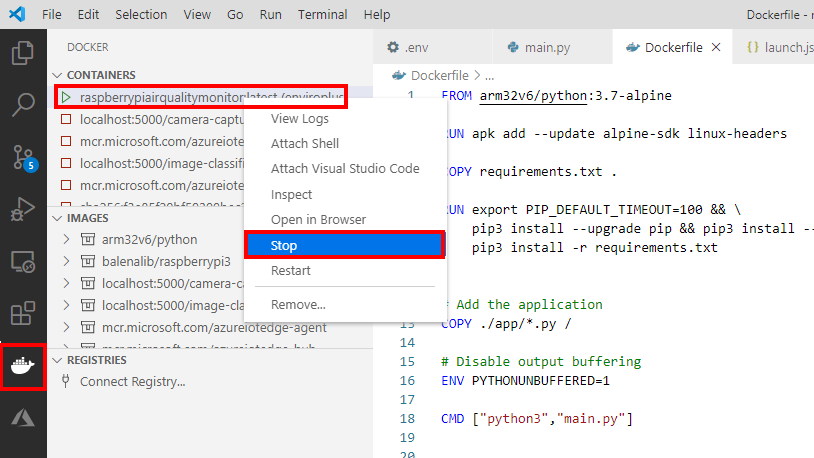
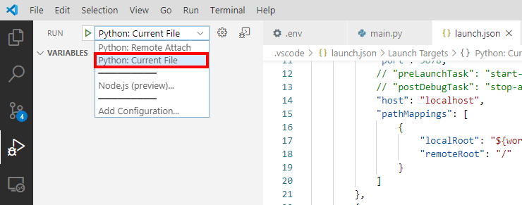
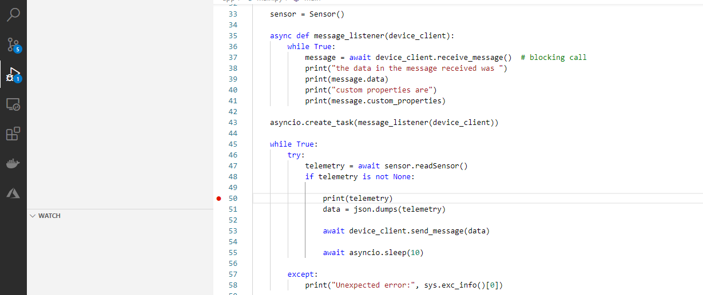

# Module 5: Dockerize the Air Quality Monitor solution

---

* Module 1: [Create an Azure IoT Central application](../module_1_create_iot_hub/README.md)
* Module 2: [Set up your Raspberry Pi](../module_2_set_up_raspberry_pi/README.md)
* Module 3: [Set up your development environment](../module_3_set_up_computer/README.md)
* Module 4: [Run the solution](../module_4_building_the_solution/README.md)
* Module 5: [Dockerize the Air Quality Monitor solution](../module_5_docker/README.md)
* [Home](../../README.md)

---

There are several reasons that you might want to dockerize your application. Including deploying to other devices, recovery, and deploying as part of an [Azure IoT Edge](https://docs.microsoft.com/en-us/azure/iot-edge/?WT.mc_id=julyot-aqm-dglover) solution.  For now, we are just going to learn how to dockerize the application.

## Exploring the Docker configuration

1. Ensure the Visual Studio Code file explorer is in view. From the Visual Studio Code main menu click **File**, then click **Explorer**.
2. Open the **Dockerfile** file. This file describes how to build the Docker image. You will see the image will be built upon the apline Python 3.7 base image.

## Build the Docker image

1. Right mouse click on the **Dockerfile**. From the context menu, select **Build image**.

    
2. You will be asked to name the image. press <kbd>Enter</kbd> to accept the default name.
3. Observe the build process. It will take a few minutes depending on your internet connection speed and the what model Raspberry Pi you have.

## Start the Docker Image

Now the Docker image has build we will want to start the image.

1. Ensure you have stopped debugging the application.
2. From the Visual Studio **Terminal** window, type the following:
    
    ```bash
    docker run -it --privileged -p 5678:5678 --rm  --name enviroplus --env-file .env  raspberrypiairqualitymonitor:latest
    ```

    This starts the docker container in interactive mode. Privileged mode is required so the application can access the physical hardware sensor. The Python debugger ports are mapped into the container, and the .env environment file with the IoT Central connection information is also passed into the container.

### Stopping the Docker container

1. From Visual Studio Code, click on the Docker icon in the sidebar menu.
2. Right mouse click on the **raspberrypiairqualitymonitor** running container, and from the context menu, select **Stop**

    

## Setting the Docker container to start when the Raspberry Pi boot

Using the Docker restart feature is a handy way to automatically start the air quality monitor when the Raspberry Pi starts.

1. From the Visual Studio Code **Terminal** window, type the following:

    ```bash
    docker run -d  --privileged -p 5678:5678 --restart always --name enviroplus  --env-file .env  raspberrypiairqualitymonitor:latest
    ```

## Attaching the debugger to the running Docker container

Some times it can be very handy to attach the debugger to a misbehaving application that is running inside of a container.

1. Select the **Run** configuration. From the Visual Studio Code main menu, click **View**, then **Run**.
2. From the **Run** drop down menu, select **Python: Remote Attach**
    
3. Press <kbd>F5</kbd> to attach the Python debugger to the application running in the container.
4. Switch to the **main.py** file, and set a breakpoint around line 50 in the code. 

    To set a breakpoint, click in the gutter, just to the left of the line numbers.

    
5. Now step through the code using the **Debugger Toolbar**, or press <kbd>F5</kbd> to continue, <kbd>F10</kbd> to over, <kbd>F11</kbd> to step into, <kbd>Shift+F11</kbd> to step out, and <kbd>Shift+F5</kbd> to disconnect the debugger from the container.

    Check out the [Debug your Python code](https://docs.microsoft.com/en-us/visualstudio/python/debugging-python-in-visual-studio?view=vs-2019&WT.mc_id=julyot-aqm-dglover) article to learn more about debugging Python applications with Visual Studio Code.

[Home](../../README.md)